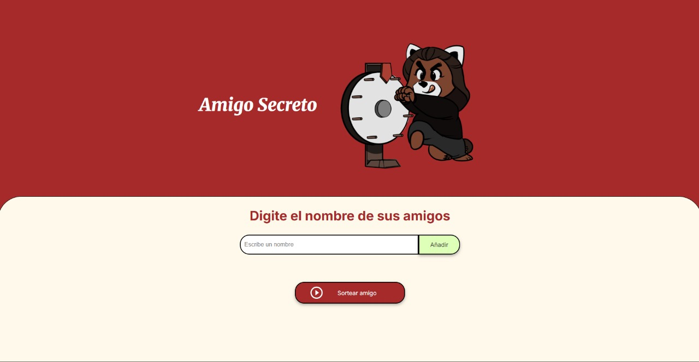

# 🎁 Amigo Secreto

---

---

¡Hola! 👋  
Este es mi primer proyecto web para organizar un sorteo de **Amigo Secreto**. Lo hice como parte de mi aprendizaje en programación, usando HTML, CSS (Todo entregado por Alura el material preparado) y JavaScript básico, hecho por mi.

---

## 🚀 ¿De qué trata este proyecto?

Permite ingresar los nombres de tus amigos (o cualquier cosa aleatoria xD) y, al hacer clic en un botón, elige uno al azar como tu amigo secreto. Es una forma divertida y sencilla de practicar lógica de programación y compartir con amigos.

---

## 🛠️ Tecnologías utilizadas

- **HTML5**  (Aportado por Alura)
- **CSS3**   (Aportado por Alura)
- **JavaScript** (básico)

---

## 💻 ¿Cómo usarlo?

1. Descarga o clona este repositorio.
2. Abre el archivo `index.html` en tu navegador.
3. Escribe los nombres de los participantes y haz clic en "Añadir".
4. Cuando estén todos los nombres, haz clic en el botón de sorteo para ver quién es tu amigo secreto.

---

## 📸 Captura de pantalla

---

## 📅 Cambios y avances

- **20/08/2025:** Descargué los archivos base y probé cómo modificarlos desde GitHub.
- **31/08/2025:** Agregué la lógica del juego, una imagen y cambié algunos colores para que se vea más bonito. La imagen fue hecha por el Ilustrador @Alexknightarts

---

## 🙋‍♀️ Sobre mí

Estoy empezando en el mundo de la programación y este es uno de mis primeros proyectos.  
¡Gracias por visitar mi repositorio! Si tienes sugerencias o encuentras algún error, puedes dejarme un comentario o sugerencia.

---

*Hecho con Cariño mientras aprendo a programar.*